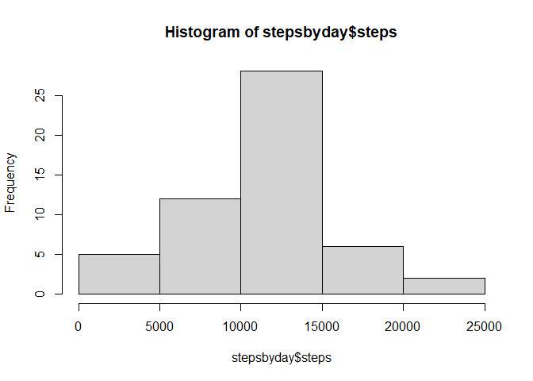
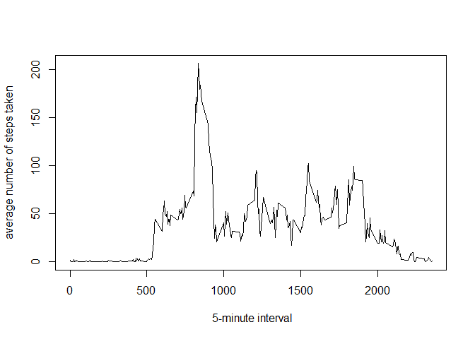
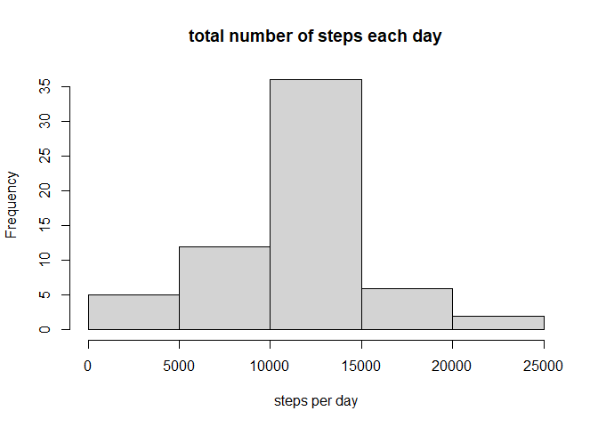
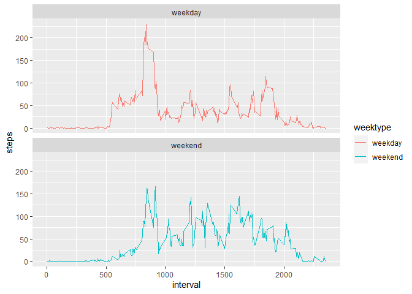

## Loading and preprocessing the data


```r
library(ggplot2)
library(dplyr)
```

```
## 
## Attaching package: 'dplyr'
```

```
## The following objects are masked from 'package:stats':
## 
##     filter, lag
```

```
## The following objects are masked from 'package:base':
## 
##     intersect, setdiff, setequal, union
```

```r
if(!file.exists("./data")) {dir.create("./data")}
fileUrl <- "https://d396qusza40orc.cloudfront.net/repdata%2Fdata%2Factivity.zip"
download.file(fileUrl, destfile = "./data/activity.zip")
projectData <- unzip("./data/activity.zip", exdir = "./data" )
View(projectData)
df <- read.csv("./data/activity.csv")
View(df)
str(df)
```

```
## 'data.frame':	17568 obs. of  3 variables:
##  $ steps   : int  NA NA NA NA NA NA NA NA NA NA ...
##  $ date    : chr  "2012-10-01" "2012-10-01" "2012-10-01" "2012-10-01" ...
##  $ interval: int  0 5 10 15 20 25 30 35 40 45 ...
```

```r
df$date <- as.Date(df$date, format = "%Y-%m-%d")
summary(df)
```

```
##      steps             date               interval     
##  Min.   :  0.00   Min.   :2012-10-01   Min.   :   0.0  
##  1st Qu.:  0.00   1st Qu.:2012-10-16   1st Qu.: 588.8  
##  Median :  0.00   Median :2012-10-31   Median :1177.5  
##  Mean   : 37.38   Mean   :2012-10-31   Mean   :1177.5  
##  3rd Qu.: 12.00   3rd Qu.:2012-11-15   3rd Qu.:1766.2  
##  Max.   :806.00   Max.   :2012-11-30   Max.   :2355.0  
##  NA's   :2304
```

## What is mean total number of steps taken per day?

1. Calculate the total number of steps taken per day


```r
stepsbyday <- aggregate(steps ~ date, df, sum, na.rm = TRUE)
head(stepsbyday)
```

```
##         date steps
## 1 2012-10-02   126
## 2 2012-10-03 11352
## 3 2012-10-04 12116
## 4 2012-10-05 13294
## 5 2012-10-06 15420
## 6 2012-10-07 11015
```

2. Make a histogram of the total number of steps taken each day


```r
 hist(stepsbyday$steps)
```

<!-- -->

3. Calculate and report the mean and median of the total number of steps taken per day

    Here's the mean of the total number of steps
    

```r
meanstepsbyday <- mean(stepsbyday$steps)
meanstepsbyday
```

```
## [1] 10766.19
```
    Here's the median of the total number of steps 
    

```r
medianstepsbyday <- median(stepsbyday$steps)
medianstepsbyday
```

```
## [1] 10765
```

## What is the average daily activity pattern?
1. Make a time series plot


```r
stepsperinterval <- aggregate(steps ~ interval, data = df, mean, na.rm = TRUE)
with(stepsperinterval, plot(steps~interval, type = "l", xlab = " 5-minute interval", ylab = "average number of steps taken"))
```

<!-- -->

2. Maximum number of steps


```r
maxsteps <- stepsperinterval[which.max(stepsperinterval$steps),]$interval
maxsteps
```

```
## [1] 835
```

## Imputing missing values

1. Calculate and report the total number of missing values in the dataset


```r
totalmissingvalues <- sum(is.na(df$steps))
totalmissingvalues
```

```
## [1] 2304
```

2. Create a new dataset that is equal to the original dataset but with the missing data filled in


```r
        newdf <- df
        na <- is.na(df$steps)
        avg_interval <- with(newdf, tapply(steps, interval, mean, na.rm = TRUE, simplify = TRUE))
        newdf$steps[na] <- avg_interval[as.character(newdf$interval[na])]
```

3. Calculating the steps


```r
newsteps <- newdf %>%
    filter(!is.na(newdf$steps)) %>%
    group_by(date) %>%
    summarise(steps = sum(steps)) %>%
    print
```

```
## `summarise()` ungrouping output (override with `.groups` argument)
```

```
## # A tibble: 61 x 2
##    date        steps
##    <date>      <dbl>
##  1 2012-10-01 10766.
##  2 2012-10-02   126 
##  3 2012-10-03 11352 
##  4 2012-10-04 12116 
##  5 2012-10-05 13294 
##  6 2012-10-06 15420 
##  7 2012-10-07 11015 
##  8 2012-10-08 10766.
##  9 2012-10-09 12811 
## 10 2012-10-10  9900 
## # ... with 51 more rows
```
4. Make a histogram of the total number of steps taken each day


```r
        hist(newsteps$steps, xlab = "steps per day", main = "total number of steps each day")
```

<!-- -->

5.Calculate and report the mean and median total number of steps taken per day

```r
meanNewsteps <- mean(newsteps$steps, na.rm = TRUE)
meanNewsteps
```

```
## [1] 10766.19
```

```r
medianNewsteps <- median(newsteps$steps, na.rm = TRUE)
medianNewsteps
```

```
## [1] 10766.19
```
## Are there differences in activity patterns between weekdays and weekends?
1. Create a new factor variable in the dataset with two levels – “weekday” and “weekend” indicating whether a given date is a weekday or weekend day.


```r
newdf$weekday <- as.factor(weekdays(newdf$date))
newdf$weektype <- if_else(newdf$weekday %in% c("Saturday", "Sunday"), "weekend", "weekday")
head(newdf)
```

```
##       steps       date interval weekday weektype
## 1 1.7169811 2012-10-01        0  Monday  weekday
## 2 0.3396226 2012-10-01        5  Monday  weekday
## 3 0.1320755 2012-10-01       10  Monday  weekday
## 4 0.1509434 2012-10-01       15  Monday  weekday
## 5 0.0754717 2012-10-01       20  Monday  weekday
## 6 2.0943396 2012-10-01       25  Monday  weekday
```
2. Make a panel plot containing a time series plot

```r
 newInterval <- aggregate(steps ~ interval + weektype, data = newdf, mean, na.rm = TRUE)
 g <- ggplot(newInterval, aes(x = interval, y = steps, color = weektype))
 g <- g + geom_line() + facet_wrap(~ weektype, ncol = 1, nrow = 2)
 print(g)
```

<!-- -->
 
